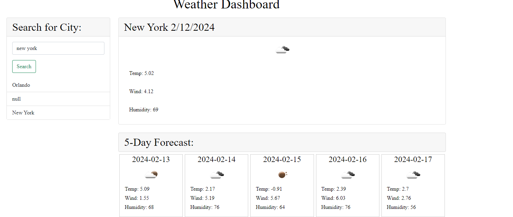

<h1>Weather Dashboard</h1>

<h2>Description</h2>
This website shows users the wind speed, humidity, and temperature for any city of their choice.

<h2>Table Of Contents</h2>

<a href='#install'>Install</a>

<a href='#usage'>Usage</a>

<a href ='#license'>License</a>

<a href ='#contributions'>Contributions</a>

<a href ='#tests'>Tests</a>

<a href='#questions'>Questions</a>

<h2 id='install'>Installation</h2>
Open the website using git hub pages link or as live server

<h2 id='usage'>Usage</h2>To begin all you have to do is search a city!

<h2 id='license'>License</h2>MIT

<h2 id='contributions'>Contributions</h2>Research on W3 schools and stack overflow

<h2 id='tests'>Tests</h2>N/A

<h2 id='questions'>Questions</h2>

Find me on Github: @ayay2002

https://github.com/ayay2002

Email: ayaypsn@gmail.com

If you have any questions regarding this project please contact me at the above listed email and i will get back to you as soon as possible! Thank you.